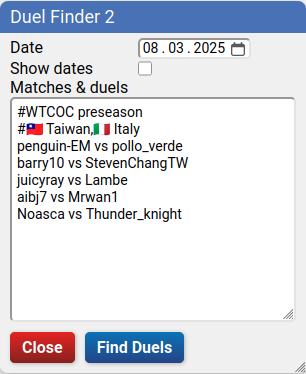
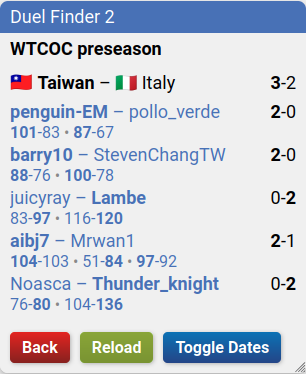

# bga-duel-finder
Find Carcassonne duels on BGA and display their results – be it games of random players or team matches like WTCOC. Progress of currently running games is shown, too.

## ✨ Demo


### Screenshots





🔥 indicates game in progress.
🏟️ indicates arena game.
🏳️ indicates someone conceded the game.

## 📦 Setup
Create a new bookmark in your browser that points to this "address":
```
javascript:(function()%7B%2F**%0A%20*%20BGA%20Duel%20Finder%202%0A%20*%0A%20*%20Find%20and%20display%20duels%20from%20a%20list%20of%20fixtures.%0A%20*%20Highlight%20winnning%20scores%2C%20calculate%20duel%20and%20team%20match%20results.%0A%20*%20cf.%20README.md%20or%20https%3A%2F%2Fgithub.com%2Fyzemaze%2Fbga-duel-finder%0A%20*%2F%0A%0A(function()%20%7B%0A%22use%20strict%22%3B%0A%0A%09const%20REQUEST_INTERVAL%20%3D%20250%3B%20%2F%2F%20ms%0A%09const%20CACHE_DURATION%20%3D%207*24*60*60*1000%3B%20%2F%2F%207d%20in%20ms%0A%09const%20DATA_CACHE_DURATION%20%3D%202*60*60*1000%3B%20%2F%2F%202h%20in%20ms%0A%09let%20flags%20%3D%20new%20Map(%5B%0A%09%09%5B%22Afghanistan%22%2C%20%22%F0%9F%87%A6%F0%9F%87%AB%22%5D%2C%0A%09%09%5B%22Albania%22%2C%20%22%F0%9F%87%A6%F0%9F%87%B1%22%5D%2C%0A%09%09%5B%22Algeria%22%2C%20%22%F0%9F%87%A9%F0%9F%87%BF%22%5D%2C%0A%09%09%5B%22Andorra%22%2C%20%22%F0%9F%87%A6%F0%9F%87%A9%22%5D%2C%0A%09%09%5B%22Angola%22%2C%20%22%F0%9F%87%A6%F0%9F%87%B4%22%5D%2C%0A%09%09%5B%22Antigua%20and%20Barbuda%22%2C%20%22%F0%9F%87%A6%F0%9F%87%AC%22%5D%2C%0A%09%09%5B%22Argentina%22%2C%20%22%F0%9F%87%A6%F0%9F%87%B7%22%5D%2C%0A%09%09%5B%22Armenia%22%2C%20%22%F0%9F%87%A6%F0%9F%87%B2%22%5D%2C%0A%09%09%5B%22Australia%22%2C%20%22%F0%9F%87%A6%F0%9F%87%BA%22%5D%2C%0A%09%09%5B%22Austria%22%2C%20%22%F0%9F%87%A6%F0%9F%87%B9%22%5D%2C%0A%09%09%5B%22Azerbaijan%22%2C%20%22%F0%9F%87%A6%F0%9F%87%BF%22%5D%2C%0A%09%09%5B%22Bahamas%22%2C%20%22%F0%9F%87%A7%F0%9F%87%B8%22%5D%2C%0A%09%09%5B%22Bahrain%22%2C%20%22%F0%9F%87%A7%F0%9F%87%AD%22%5D%2C%0A%09%09%5B%22Bangladesh%22%2C%20%22%F0%9F%87%A7%F0%9F%87%A9%22%5D%2C%0A%09%09%5B%22Barbados%22%2C%20%22%F0%9F%87%A7%F0%9F%87%A7%22%5D%2C%0A%09%09%5B%22Belarus%22%2C%20%22%F0%9F%87%A7%F0%9F%87%BE%22%5D%2C%0A%09%09%5B%22Belgium%22%2C%20%22%F0%9F%87%A7%F0%9F%87%AA%22%5D%2C%0A%09%09%5B%22Belize%22%2C%20%22%F0%9F%87%A7%F0%9F%87%BF%22%5D%2C%0A%09%09%5B%22Benin%22%2C%20%22%F0%9F%87%A7%F0%9F%87%AF%22%5D%2C%0A%09%09%5B%22Bhutan%22%2C%20%22%F0%9F%87%A7%F0%9F%87%B9%22%5D%2C%0A%09%09%5B%22Bolivia%22%2C%20%22%F0%9F%87%A7%F0%9F%87%B4%22%5D%2C%0A%09%09%5B%22Bosnia%20and%20Herzegovina%22%2C%20%22%F0%9F%87%A7%F0%9F%87%A6%22%5D%2C%0A%09%09%5B%22Botswana%22%2C%20%22%F0%9F%87%A7%F0%9F%87%BC%22%5D%2C%0A%09%09%5B%22Brazil%22%2C%20%22%F0%9F%87%A7%F0%9F%87%B7%22%5D%2C%0A%09%09%5B%22Brunei%22%2C%20%22%F0%9F%87%A7%F0%9F%87%B3%22%5D%2C%0A%09%09%5B%22Bulgaria%22%2C%20%22%F0%9F%87%A7%F0%9F%87%AC%22%5D%2C%0A%09%09%5B%22Burkina%20Faso%22%2C%20%22%F0%9F%87%A7%F0%9F%87%AB%22%5D%2C%0A%09%09%5B%22Burundi%22%2C%20%22%F0%9F%87%A7%F0%9F%87%AE%22%5D%2C%0A%09%09%5B%22Cabo%20Verde%22%2C%20%22%F0%9F%87%A8%F0%9F%87%BB%22%5D%2C%0A%09%09%5B%22Cambodia%22%2C%20%22%F0%9F%87%B0%F0%9F%87%AD%22%5D%2C%0A%09%09%5B%22Cameroon%22%2C%20%22%F0%9F%87%A8%F0%9F%87%B2%22%5D%2C%0A%09%09%5B%22Canada%22%2C%20%22%F0%9F%87%A8%F0%9F%87%A6%22%5D%2C%0A%09%09%5B%22Catalonia%22%2C%20%22%22%5D%2C%0A%09%09%5B%22Central%20African%20Republic%22%2C%20%22%F0%9F%87%A8%F0%9F%87%AB%22%5D%2C%0A%09%09%5B%22Chad%22%2C%20%22%F0%9F%87%B9%F0%9F%87%A9%22%5D%2C%0A%09%09%5B%22Chile%22%2C%20%22%F0%9F%87%A8%F0%9F%87%B1%22%5D%2C%0A%09%09%5B%22China%22%2C%20%22%F0%9F%87%A8%F0%9F%87%B3%22%5D%2C%0A%09%09%5B%22Colombia%22%2C%20%22%F0%9F%87%A8%F0%9F%87%B4%22%5D%2C%0A%09%09%5B%22Comoros%22%2C%20%22%F0%9F%87%B0%F0%9F%87%B2%22%5D%2C%0A%09%09%5B%22Congo-Brazzaville%22%2C%20%22%F0%9F%87%A8%F0%9F%87%AC%22%5D%2C%0A%09%09%5B%22Congo%20(Democratic%20Republic)%22%2C%20%22%F0%9F%87%A8%F0%9F%87%A9%22%5D%2C%0A%09%09%5B%22Costa%20Rica%22%2C%20%22%F0%9F%87%A8%F0%9F%87%B7%22%5D%2C%0A%09%09%5B%22Croatia%22%2C%20%22%F0%9F%87%AD%F0%9F%87%B7%22%5D%2C%0A%09%09%5B%22Cuba%22%2C%20%22%F0%9F%87%A8%F0%9F%87%BA%22%5D%2C%0A%09%09%5B%22Cyprus%22%2C%20%22%F0%9F%87%A8%F0%9F%87%BE%22%5D%2C%0A%09%09%5B%22Czechia%22%2C%20%22%F0%9F%87%A8%F0%9F%87%BF%22%5D%2C%0A%09%09%5B%22Denmark%22%2C%20%22%F0%9F%87%A9%F0%9F%87%B0%22%5D%2C%0A%09%09%5B%22Djibouti%22%2C%20%22%F0%9F%87%A9%F0%9F%87%AF%22%5D%2C%0A%09%09%5B%22Dominica%22%2C%20%22%F0%9F%87%A9%F0%9F%87%B2%22%5D%2C%0A%09%09%5B%22Dominican%20Republic%22%2C%20%22%F0%9F%87%A9%F0%9F%87%B4%22%5D%2C%0A%09%09%5B%22Ecuador%22%2C%20%22%F0%9F%87%AA%F0%9F%87%A8%22%5D%2C%0A%09%09%5B%22Egypt%22%2C%20%22%F0%9F%87%AA%F0%9F%87%AC%22%5D%2C%0A%09%09%5B%22El%20Salvador%22%2C%20%22%F0%9F%87%B8%F0%9F%87%BB%22%5D%2C%0A%09%09%5B%22Equatorial%20Guinea%22%2C%20%22%F0%9F%87%AC%F0%9F%87%B6%22%5D%2C%0A%09%09%5B%22Eritrea%22%2C%20%22%F0%9F%87%AA%F0%9F%87%B7%22%5D%2C%0A%09%09%5B%22Estonia%22%2C%20%22%F0%9F%87%AA%F0%9F%87%AA%22%5D%2C%0A%09%09%5B%22Eswatini%22%2C%20%22%F0%9F%87%B8%F0%9F%87%BF%22%5D%2C%0A%09%09%5B%22Ethiopia%22%2C%20%22%F0%9F%87%AA%F0%9F%87%B9%22%5D%2C%0A%09%09%5B%22Fiji%22%2C%20%22%F0%9F%87%AB%F0%9F%87%AF%22%5D%2C%0A%09%09%5B%22Finland%22%2C%20%22%F0%9F%87%AB%F0%9F%87%AE%22%5D%2C%0A%09%09%5B%22France%22%2C%20%22%F0%9F%87%AB%F0%9F%87%B7%22%5D%2C%0A%09%09%5B%22Gabon%22%2C%20%22%F0%9F%87%AC%F0%9F%87%A6%22%5D%2C%0A%09%09%5B%22Gambia%22%2C%20%22%F0%9F%87%AC%F0%9F%87%B2%22%5D%2C%0A%09%09%5B%22Georgia%22%2C%20%22%F0%9F%87%AC%F0%9F%87%AA%22%5D%2C%0A%09%09%5B%22Germany%22%2C%20%22%F0%9F%87%A9%F0%9F%87%AA%22%5D%2C%0A%09%09%5B%22Ghana%22%2C%20%22%F0%9F%87%AC%F0%9F%87%AD%22%5D%2C%0A%09%09%5B%22Greece%22%2C%20%22%F0%9F%87%AC%F0%9F%87%B7%22%5D%2C%0A%09%09%5B%22Grenada%22%2C%20%22%F0%9F%87%AC%F0%9F%87%A9%22%5D%2C%0A%09%09%5B%22Guatemala%22%2C%20%22%F0%9F%87%AC%F0%9F%87%B9%22%5D%2C%0A%09%09%5B%22Guinea%22%2C%20%22%F0%9F%87%AC%F0%9F%87%B3%22%5D%2C%0A%09%09%5B%22Guinea-Bissau%22%2C%20%22%F0%9F%87%AC%F0%9F%87%BC%22%5D%2C%0A%09%09%5B%22Guyana%22%2C%20%22%F0%9F%87%AC%F0%9F%87%BE%22%5D%2C%0A%09%09%5B%22Haiti%22%2C%20%22%F0%9F%87%AD%F0%9F%87%B9%22%5D%2C%0A%09%09%5B%22Honduras%22%2C%20%22%F0%9F%87%AD%F0%9F%87%B3%22%5D%2C%0A%09%09%5B%22Hong%20Kong%22%2C%20%22%F0%9F%87%AD%F0%9F%87%B0%22%5D%2C%0A%09%09%5B%22Hungary%22%2C%20%22%F0%9F%87%AD%F0%9F%87%BA%22%5D%2C%0A%09%09%5B%22Iceland%22%2C%20%22%F0%9F%87%AE%F0%9F%87%B8%22%5D%2C%0A%09%09%5B%22India%22%2C%20%22%F0%9F%87%AE%F0%9F%87%B3%22%5D%2C%0A%09%09%5B%22Indonesia%22%2C%20%22%F0%9F%87%AE%F0%9F%87%A9%22%5D%2C%0A%09%09%5B%22Iran%22%2C%20%22%F0%9F%87%AE%F0%9F%87%B7%22%5D%2C%0A%09%09%5B%22Iraq%22%2C%20%22%F0%9F%87%AE%F0%9F%87%B6%22%5D%2C%0A%09%09%5B%22Ireland%22%2C%20%22%F0%9F%87%AE%F0%9F%87%AA%22%5D%2C%0A%09%09%5B%22Israel%22%2C%20%22%F0%9F%87%AE%F0%9F%87%B1%22%5D%2C%0A%09%09%5B%22Italy%22%2C%20%22%F0%9F%87%AE%F0%9F%87%B9%22%5D%2C%0A%09%09%5B%22Jamaica%22%2C%20%22%F0%9F%87%AF%F0%9F%87%B2%22%5D%2C%0A%09%09%5B%22Japan%22%2C%20%22%F0%9F%87%AF%F0%9F%87%B5%22%5D%2C%0A%09%09%5B%22Jordan%22%2C%20%22%F0%9F%87%AF%F0%9F%87%B4%22%5D%2C%0A%09%09%5B%22Kazakhstan%22%2C%20%22%F0%9F%87%B0%F0%9F%87%BF%22%5D%2C%0A%09%09%5B%22Kenya%22%2C%20%22%F0%9F%87%B0%F0%9F%87%AA%22%5D%2C%0A%09%09%5B%22Kiribati%22%2C%20%22%F0%9F%87%B0%F0%9F%87%AE%22%5D%2C%0A%09%09%5B%22North%20Korea%22%2C%20%22%F0%9F%87%B0%F0%9F%87%B5%22%5D%2C%0A%09%09%5B%22South%20Korea%22%2C%20%22%F0%9F%87%B0%F0%9F%87%B7%22%5D%2C%0A%09%09%5B%22Kuwait%22%2C%20%22%F0%9F%87%B0%F0%9F%87%BC%22%5D%2C%0A%09%09%5B%22Kyrgyzstan%22%2C%20%22%F0%9F%87%B0%F0%9F%87%AC%22%5D%2C%0A%09%09%5B%22Laos%22%2C%20%22%F0%9F%87%B1%F0%9F%87%B8%22%5D%2C%0A%09%09%5B%22Latvia%22%2C%20%22%F0%9F%87%B1%F0%9F%87%BB%22%5D%2C%0A%09%09%5B%22Lebanon%22%2C%20%22%F0%9F%87%B1%F0%9F%87%A7%22%5D%2C%0A%09%09%5B%22Lesotho%22%2C%20%22%F0%9F%87%B1%F0%9F%87%B8%22%5D%2C%0A%09%09%5B%22Liberia%22%2C%20%22%F0%9F%87%B1%F0%9F%87%B7%22%5D%2C%0A%09%09%5B%22Libya%22%2C%20%22%F0%9F%87%B1%F0%9F%87%BE%22%5D%2C%0A%09%09%5B%22Liechtenstein%22%2C%20%22%F0%9F%87%B1%F0%9F%87%AE%22%5D%2C%0A%09%09%5B%22Lithuania%22%2C%20%22%F0%9F%87%B1%F0%9F%87%B9%22%5D%2C%0A%09%09%5B%22Luxembourg%22%2C%20%22%F0%9F%87%B1%F0%9F%87%BA%22%5D%2C%0A%09%09%5B%22Madagascar%22%2C%20%22%F0%9F%87%B2%F0%9F%87%AC%22%5D%2C%0A%09%09%5B%22Malawi%22%2C%20%22%F0%9F%87%B2%F0%9F%87%BC%22%5D%2C%0A%09%09%5B%22Malaysia%22%2C%20%22%F0%9F%87%B2%F0%9F%87%BE%22%5D%2C%0A%09%09%5B%22Maldives%22%2C%20%22%F0%9F%87%B2%F0%9F%87%BB%22%5D%2C%0A%09%09%5B%22Mali%22%2C%20%22%F0%9F%87%B2%F0%9F%87%B1%22%5D%2C%0A%09%09%5B%22Malta%22%2C%20%22%F0%9F%87%B2%F0%9F%87%B9%22%5D%2C%0A%09%09%5B%22Marshall%20Islands%22%2C%20%22%F0%9F%87%B2%F0%9F%87%AD%22%5D%2C%0A%09%09%5B%22Mauritania%22%2C%20%22%F0%9F%87%B2%F0%9F%87%B7%22%5D%2C%0A%09%09%5B%22Mauritius%22%2C%20%22%F0%9F%87%B2%F0%9F%87%BA%22%5D%2C%0A%09%09%5B%22Mexico%22%2C%20%22%F0%9F%87%B2%F0%9F%87%BD%22%5D%2C%0A%09%09%5B%22Micronesia%22%2C%20%22%F0%9F%87%AB%F0%9F%87%B2%22%5D%2C%0A%09%09%5B%22Moldova%22%2C%20%22%F0%9F%87%B2%F0%9F%87%A9%22%5D%2C%0A%09%09%5B%22Monaco%22%2C%20%22%F0%9F%87%B2%F0%9F%87%A8%22%5D%2C%0A%09%09%5B%22Mongolia%22%2C%20%22%F0%9F%87%B2%F0%9F%87%B3%22%5D%2C%0A%09%09%5B%22Montenegro%22%2C%20%22%F0%9F%87%B2%F0%9F%87%AA%22%5D%2C%0A%09%09%5B%22Morocco%22%2C%20%22%F0%9F%87%B2%F0%9F%87%A6%22%5D%2C%0A%09%09%5B%22Mozambique%22%2C%20%22%F0%9F%87%B2%F0%9F%87%BF%22%5D%2C%0A%09%09%5B%22Myanmar%22%2C%20%22%F0%9F%87%B2%F0%9F%87%B2%22%5D%2C%0A%09%09%5B%22Namibia%22%2C%20%22%F0%9F%87%B3%F0%9F%87%A6%22%5D%2C%0A%09%09%5B%22Nauru%22%2C%20%22%F0%9F%87%B3%F0%9F%87%B7%22%5D%2C%0A%09%09%5B%22Nepal%22%2C%20%22%F0%9F%87%B3%F0%9F%87%B5%22%5D%2C%0A%09%09%5B%22Netherlands%22%2C%20%22%F0%9F%87%B3%F0%9F%87%B1%22%5D%2C%0A%09%09%5B%22New%20Zealand%22%2C%20%22%F0%9F%87%B3%F0%9F%87%BF%22%5D%2C%0A%09%09%5B%22Nicaragua%22%2C%20%22%F0%9F%87%B3%F0%9F%87%AE%22%5D%2C%0A%09%09%5B%22Niger%22%2C%20%22%F0%9F%87%B3%F0%9F%87%AA%22%5D%2C%0A%09%09%5B%22Nigeria%22%2C%20%22%F0%9F%87%B3%F0%9F%87%AC%22%5D%2C%0A%09%09%5B%22North%20Macedonia%22%2C%20%22%F0%9F%87%B2%F0%9F%87%B0%22%5D%2C%0A%09%09%5B%22Norway%22%2C%20%22%F0%9F%87%B3%F0%9F%87%B4%22%5D%2C%0A%09%09%5B%22Oman%22%2C%20%22%F0%9F%87%B4%F0%9F%87%B2%22%5D%2C%0A%09%09%5B%22Pakistan%22%2C%20%22%F0%9F%87%B5%F0%9F%87%B0%22%5D%2C%0A%09%09%5B%22Palau%22%2C%20%22%F0%9F%87%B5%F0%9F%87%AC%22%5D%2C%0A%09%09%5B%22Panama%22%2C%20%22%F0%9F%87%B5%F0%9F%87%A6%22%5D%2C%0A%09%09%5B%22Papua%20New%20Guinea%22%2C%20%22%F0%9F%87%B5%F0%9F%87%AC%22%5D%2C%0A%09%09%5B%22Paraguay%22%2C%20%22%F0%9F%87%B5%F0%9F%87%BE%22%5D%2C%0A%09%09%5B%22Peru%22%2C%20%22%F0%9F%87%B5%F0%9F%87%AA%22%5D%2C%0A%09%09%5B%22Philippines%22%2C%20%22%F0%9F%87%B5%F0%9F%87%AD%22%5D%2C%0A%09%09%5B%22Poland%22%2C%20%22%F0%9F%87%B5%F0%9F%87%B1%22%5D%2C%0A%09%09%5B%22Portugal%22%2C%20%22%F0%9F%87%B5%F0%9F%87%B9%22%5D%2C%0A%09%09%5B%22Qatar%22%2C%20%22%F0%9F%87%B6%F0%9F%87%A6%22%5D%2C%0A%09%09%5B%22Romania%22%2C%20%22%F0%9F%87%B7%F0%9F%87%B4%22%5D%2C%0A%09%09%5B%22Russia%22%2C%20%22%F0%9F%87%B7%F0%9F%87%BA%22%5D%2C%0A%09%09%5B%22Rwanda%22%2C%20%22%F0%9F%87%B7%F0%9F%87%BC%22%5D%2C%0A%09%09%5B%22Saint%20Kitts%20and%20Nevis%22%2C%20%22%F0%9F%87%B0%F0%9F%87%B3%22%5D%2C%0A%09%09%5B%22Saint%20Lucia%22%2C%20%22%F0%9F%87%B1%F0%9F%87%A8%22%5D%2C%0A%09%09%5B%22Saint%20Vincent%20and%20the%20Grenadines%22%2C%20%22%F0%9F%87%BB%F0%9F%87%A8%22%5D%2C%0A%09%09%5B%22Samoa%22%2C%20%22%F0%9F%87%BC%F0%9F%87%B8%22%5D%2C%0A%09%09%5B%22San%20Marino%22%2C%20%22%F0%9F%87%B8%F0%9F%87%B2%22%5D%2C%0A%09%09%5B%22Sao%20Tome%20and%20Principe%22%2C%20%22%F0%9F%87%B8%F0%9F%87%B9%22%5D%2C%0A%09%09%5B%22Saudi%20Arabia%22%2C%20%22%F0%9F%87%B8%F0%9F%87%A6%22%5D%2C%0A%09%09%5B%22Senegal%22%2C%20%22%F0%9F%87%B8%F0%9F%87%B3%22%5D%2C%0A%09%09%5B%22Serbia%22%2C%20%22%F0%9F%87%B7%F0%9F%87%B8%22%5D%2C%0A%09%09%5B%22Seychelles%22%2C%20%22%F0%9F%87%B8%F0%9F%87%A8%22%5D%2C%0A%09%09%5B%22Sierra%20Leone%22%2C%20%22%F0%9F%87%B8%F0%9F%87%B1%22%5D%2C%0A%09%09%5B%22Singapore%22%2C%20%22%F0%9F%87%B8%F0%9F%87%AC%22%5D%2C%0A%09%09%5B%22Slovakia%22%2C%20%22%F0%9F%87%B8%F0%9F%87%B0%22%5D%2C%0A%09%09%5B%22Slovenia%22%2C%20%22%F0%9F%87%B8%F0%9F%87%AE%22%5D%2C%0A%09%09%5B%22Solomon%20Islands%22%2C%20%22%F0%9F%87%B8%F0%9F%87%A7%22%5D%2C%0A%09%09%5B%22Somalia%22%2C%20%22%F0%9F%87%B8%F0%9F%87%B4%22%5D%2C%0A%09%09%5B%22South%20Africa%22%2C%20%22%F0%9F%87%BF%F0%9F%87%A6%22%5D%2C%0A%09%09%5B%22South%20Sudan%22%2C%20%22%F0%9F%87%B8%F0%9F%87%B8%22%5D%2C%0A%09%09%5B%22Spain%22%2C%20%22%F0%9F%87%AA%F0%9F%87%B8%22%5D%2C%0A%09%09%5B%22Sri%20Lanka%22%2C%20%22%F0%9F%87%B1%F0%9F%87%B0%22%5D%2C%0A%09%09%5B%22Sudan%22%2C%20%22%F0%9F%87%B8%F0%9F%87%A9%22%5D%2C%0A%09%09%5B%22Suriname%22%2C%20%22%F0%9F%87%B8%F0%9F%87%B7%22%5D%2C%0A%09%09%5B%22Sweden%22%2C%20%22%F0%9F%87%B8%F0%9F%87%AA%22%5D%2C%0A%09%09%5B%22Switzerland%22%2C%20%22%F0%9F%87%A8%F0%9F%87%AD%22%5D%2C%0A%09%09%5B%22Syria%22%2C%20%22%F0%9F%87%B8%F0%9F%87%BE%22%5D%2C%0A%09%09%5B%22Taiwan%22%2C%20%22%F0%9F%87%B9%F0%9F%87%BC%22%5D%2C%0A%09%09%5B%22Tajikistan%22%2C%20%22%F0%9F%87%B9%F0%9F%87%AF%22%5D%2C%0A%09%09%5B%22Tanzania%22%2C%20%22%F0%9F%87%B9%F0%9F%87%BF%22%5D%2C%0A%09%09%5B%22Thailand%22%2C%20%22%F0%9F%87%B9%F0%9F%87%AD%22%5D%2C%0A%09%09%5B%22Timor-Leste%22%2C%20%22%F0%9F%87%B9%F0%9F%87%B1%22%5D%2C%0A%09%09%5B%22Togo%22%2C%20%22%F0%9F%87%B9%F0%9F%87%AC%22%5D%2C%0A%09%09%5B%22Tonga%22%2C%20%22%F0%9F%87%B9%F0%9F%87%B4%22%5D%2C%0A%09%09%5B%22Trinidad%20and%20Tobago%22%2C%20%22%F0%9F%87%B9%F0%9F%87%B9%22%5D%2C%0A%09%09%5B%22Tunisia%22%2C%20%22%F0%9F%87%B9%F0%9F%87%B3%22%5D%2C%0A%09%09%5B%22Turkey%22%2C%20%22%F0%9F%87%B9%F0%9F%87%B7%22%5D%2C%0A%09%09%5B%22Turkmenistan%22%2C%20%22%F0%9F%87%B9%F0%9F%87%B2%22%5D%2C%0A%09%09%5B%22Tuvalu%22%2C%20%22%F0%9F%87%B9%F0%9F%87%BB%22%5D%2C%0A%09%09%5B%22Uganda%22%2C%20%22%F0%9F%87%BA%F0%9F%87%AC%22%5D%2C%0A%09%09%5B%22Ukraine%22%2C%20%22%F0%9F%87%BA%F0%9F%87%A6%22%5D%2C%0A%09%09%5B%22United%20Arab%20Emirates%22%2C%20%22%F0%9F%87%A6%F0%9F%87%AA%22%5D%2C%0A%09%09%5B%22United%20Kingdom%22%2C%20%22%F0%9F%87%AC%F0%9F%87%A7%22%5D%2C%0A%09%09%5B%22United%20States%22%2C%20%22%F0%9F%87%BA%F0%9F%87%B8%22%5D%2C%0A%09%09%5B%22Uruguay%22%2C%20%22%F0%9F%87%BA%F0%9F%87%BE%22%5D%2C%0A%09%09%5B%22Uzbekistan%22%2C%20%22%F0%9F%87%BA%F0%9F%87%BF%22%5D%2C%0A%09%09%5B%22Vanuatu%22%2C%20%22%F0%9F%87%BB%F0%9F%87%BA%22%5D%2C%0A%09%09%5B%22Vatican%20City%22%2C%20%22%F0%9F%87%BB%F0%9F%87%A6%22%5D%2C%0A%09%09%5B%22Venezuela%22%2C%20%22%F0%9F%87%BB%F0%9F%87%AA%22%5D%2C%0A%09%09%5B%22Vietnam%22%2C%20%22%F0%9F%87%BB%F0%9F%87%B3%22%5D%2C%0A%09%09%5B%22Yemen%22%2C%20%22%F0%9F%87%BE%F0%9F%87%AA%22%5D%2C%0A%09%09%5B%22Zambia%22%2C%20%22%F0%9F%87%BF%F0%9F%87%B2%22%5D%2C%0A%09%09%5B%22Zimbabwe%22%2C%20%22%F0%9F%87%BF%F0%9F%87%BC%22%5D%0A%09%5D)%3B%0A%0A%0A%09let%20style%20%3D%20document.createElement(%22style%22)%3B%0A%09style.innerHTML%20%3D%20%60%0A%09%09.drag-handle%20%7B%0A%09%09%09cursor%3A%20pointer%3B%0A%09%09%7D%0A%09%09.dragging%7B%0A%09%09%09cursor%3A%20move%20!important%3B%0A%09%09%7D%0A%09%09%23finderBox%20%7B%0A%09%09%09box-sizing%3A%20border-box%3B%0A%09%09%09display%3A%20grid%3B%0A%09%09%09grid-template-rows%3A%20max-content%201fr%3B%0A%09%09%09position%3A%20absolute%3B%0A%09%09%09left%3A%200px%3B%0A%09%09%09bottom%3A%200px%3B%0A%09%09%09width%3A%20max-content%3B%0A%09%09%09min-width%3A%20fit-content%3B%0A%09%09%09height%3A%20max-content%3B%0A%09%09%09min-height%3A%20110px%3B%0A%09%09%09background%3A%20%23f0f0f0%3B%0A%09%09%09box-shadow%3A%200%203px%208px%20rgba(0%2C0%2C0%2C.3)%3B%0A%09%09%09border-radius%3A%208px%3B%0A%09%09%09z-index%3A%2010000%3B%0A%09%09%09resize%3A%20both%3B%0A%09%09%09overflow%3A%20hidden%3B%0A%09%09%7D%0A%09%09%23finderBox%20*%20%7B%0A%09%09%09box-sizing%3A%20border-box%3B%0A%09%09%7D%0A%09%09%23finderBox%20.duel%20a%20%7B%0A%09%09%09color%3A%20rgb(72%2C%20113%2C%20182)%3B%0A%09%09%09text-decoration%3A%20none%3B%0A%09%09%7D%0A%09%09%23finderBox.horizontal%20%7B%0A%09%09%09grid-auto-flow%3A%20column%3B%0A%09%09%09grid-template-columns%3A%20max-content%201fr%20max-content%3B%0A%09%09%09grid-template-rows%3A%20none%3B%0A%09%09%09min-height%3A%2062px%3B%0A%09%09%7D%0A%09%09.horizontal%20%23finderHead%20%7B%0A%09%09%09padding%3A%2010px%3B%0A%09%09%7D%0A%09%09.horizontal%20%23finderBody%20%7B%0A%09%09%09grid-template-rows%3A%20none%3B%0A%09%09%09grid-auto-flow%3A%20column%3B%0A%09%09%09grid-template-columns%3A%201fr%20auto%3B%0A%09%09%09padding%3A%2010px%3B%0A%09%09%7D%0A%09%09.horizontal%20%23gamesList%20%7B%0A%09%09%09grid-auto-columns%3A%20max-content%3B%0A%09%09%09grid-gap%3A%2020px%3B%0A%09%09%7D%0A%09%09%23finderBox.horizontal%20h2.matchHeader%20%7B%0A%09%09%09margin%3A%200%3B%0A%09%09%7D%0A%09%09.horizontal%20.fixtureScore%2C%20.horizontal%20.duelScore%20%7B%0A%09%09%09grid-column-start%3A%202%3B%0A%09%09%7D%0A%09%09%23finderBox%20h2%20%7B%0A%09%09%09font-weight%3A%20normal%3B%0A%09%09%09margin%3A%200%3B%0A%09%09%7D%0A%09%09%23finderBox%20.bga-link%20%7B%0A%09%09%09font-weight%3A%20normal%3B%0A%09%09%7D%0A%09%09%23finderBox%20h2.dfComment%20%7B%0A%09%09%09font-weight%3A%20bold%3B%0A%09%09%7D%0A%09%09%23finderHead%20%7B%0A%09%09%09background%3A%20%234871b6%3B%0A%09%09%09color%3A%20%23fff%3B%0A%09%09%09padding%3A%205px%2010px%3B%0A%09%09%09user-select%3A%20none%3B%0A%09%09%7D%0A%09%09%23finderBody%20%7B%0A%09%09%09display%3A%20grid%3B%0A%09%09%09grid-template-rows%3A%201fr%20max-content%3B%0A%09%09%09grid-gap%3A%2010px%3B%0A%09%09%09overflow%3A%20auto%3B%0A%09%09%09padding%3A%205px%2010px%2010px%2010px%3B%0A%09%09%7D%0A%09%09%23inputForm%20%7B%0A%09%09%09display%3A%20grid%3B%0A%09%09%09grid-template-rows%3A%20repeat(3%2C%20max-content)%201fr%3B%0A%09%09%7D%0A%09%09%23inputForm%20input%20%7B%0A%09%09%09width%3A%20fit-content%3B%0A%09%09%09border-radius%3A%205px%3B%0A%09%09%7D%0A%09%09.duelsView%20%23inputForm%20%7B%0A%09%09%09display%3A%20none%3B%0A%09%09%7D%0A%09%09%23duelsConfig%2C%20%23duelsConfigLabel%20%7B%0A%09%09%09grid-column%3A%20span%202%3B%0A%09%09%7D%0A%09%09%23duelsConfig%20%7B%0A%09%09%09width%3A%20100%25%3B%0A%09%09%09border-radius%3A%205px%3B%0A%09%09%7D%0A%09%09%23buttonDiv%20%7B%0A%09%09%09display%3A%20grid%3B%0A%09%09%09grid-template-columns%3A%20repeat(3%2C%20max-content)%3B%0A%09%09%09grid-gap%3A%2010px%3B%0A%09%09%09font-size%3A%201em%3B%0A%09%09%7D%0A%09%09%23buttonDiv%20.bgabutton%20%7B%0A%09%09%09margin%3A%200%3B%0A%09%09%09height%3A%20fit-content%3B%0A%09%09%09width%3A%20fit-content%3B%0A%09%09%7D%0A%09%09%23dfFindButton%2C%20%23dfCloseButton%20%7B%0A%09%09%09display%3A%20block%3B%0A%09%09%7D%0A%09%09%23dfBackButton%2C%20%23dfReloadButton%2C%20%23dfToggleDatesButton%20%7B%0A%09%09%09display%3A%20none%3B%0A%09%09%7D%0A%09%09.duelsView%20%23dfBackButton%2C%20.duelsView%20%23dfReloadButton%2C%20.duelsView%20%23dfToggleDatesButton%20%7B%0A%09%09%09display%3A%20block%3B%0A%09%09%7D%0A%09%09.duelsView%20%23dfFindButton%2C%20.duelsView%20%23dfCloseButton%2C%20.horizontal%20%23dfToggleDatesButton%20%7B%0A%09%09%09display%3A%20none%3B%0A%09%09%7D%0A%09%09%23gamesList%20%7B%0A%09%09%09display%3A%20none%3B%0A%09%09%09overflow%3A%20auto%3B%0A%09%09%09grid-auto-rows%3A%20max-content%3B%0A%09%09%09grid-gap%3A%202px%3B%0A%09%09%09padding-right%3A%208px%3B%0A%09%09%7D%0A%09%09.duelsView%20%23gamesList%20%7B%0A%09%09%09display%3A%20grid%3B%0A%09%09%7D%0A%09%09.matchHeader%2C%20.duelHeader%20%7B%0A%09%09%09display%3A%20grid%3B%0A%09%09%09grid-template-columns%3A%20max-content%201fr%3B%0A%09%09%09grid-template-rows%3A%201fr%3B%0A%09%09%09grid-gap%3A%200.4em%3B%0A%09%09%7D%0A%09%09%23finderBox%20.matchHeader%20%7B%0A%09%09%09margin%3A%2010px%200%205px%200%3B%0A%09%09%7D%0A%09%09.fixtureScore%2C%20.duelScore%20%7B%0A%09%09%09grid-column-start%3A%203%3B%0A%09%09%7D%0A%09%09.duel%20%7B%0A%09%09%09display%3A%20grid%3B%0A%09%09%09grid-template-rows%3A%20max-content%201fr%3B%0A%09%09%7D%0A%09%09%23gamesList.noDates%20.resultDate%20%7B%0A%09%09%09display%3A%20none%3B%0A%09%09%7D%0A%09%09%23gamesList.noDates%20ul.duelGamesList%20%3E%20li%20%7B%0A%09%09%09display%3A%20inline%3B%0A%09%09%7D%0A%09%09%23gamesList.noDates%20ul.duelGamesList%20%3E%20li%3Anot(%3Alast-child)%3A%3Aafter%20%7B%0A%09%09%09content%3A%20%22%20%E2%80%A2%20%22%3B%0A%09%09%09color%3A%20%23888%3B%0A%09%09%7D%0A%09%09li.result%20%7B%0A%09%09%09display%3A%20grid%3B%0A%09%09%09grid-template-columns%3A%20repeat(3%2C%20max-content)%3B%0A%09%09%09grid-gap%3A%205px%3B%0A%09%09%09align-items%3A%20end%3B%0A%09%09%7D%0A%09%09li.result%20.resultDate%20%7B%0A%09%09%09font-size%3A%200.9em%3B%0A%09%09%7D%0A%09%09li.result%20.bga-link%20%7B%0A%09%09%09display%3A%20grid%3B%0A%09%09%09grid-template-columns%3A%201.8em%20.4em%201.8em%3B%0A%09%09%09justify-items%3A%20end%3B%0A%09%09%7D%0A%09%09.noDates%20li.result%20.bga-link%20%7B%0A%09%09%09display%3A%20inline%3B%0A%09%09%7D%0A%09%09span.win%20%7B%0A%09%09%09font-weight%3A%20bold%3B%0A%09%09%7D%0A%09%09span.progress%20%7B%0A%09%09%09grid-column%3A%203%20span%3B%0A%09%09%7D%0A%09%20%60%3B%0A%09document.head.appendChild(style)%3B%0A%0A%09createUi()%3B%0A%0A%09%2F**%0A%09%20*%20Check%20if%20a%20date%20is%20equal%20to%20today%20or%20yesterday%0A%09%20*%2F%0A%09function%20isToday(unixTimestamp)%20%7B%0A%09%09const%20today%20%3D%20new%20Date()%3B%0A%09%09const%20date%20%3D%20new%20Date(unixTimestamp%20*%201000)%3B%0A%09%09return%20(%0A%09%09%09date.setHours(0%2C0%2C0%2C0)%20%3D%3D%20today.setHours(0%2C0%2C0%2C0)%0A%09%09)%3B%0A%09%7D%0A%0A%09function%20isYesterday(unixTimestamp)%20%7B%0A%09%09const%20yesterday%20%3D%20new%20Date(Date.now%20-%2024*60*60*1000)%3B%0A%09%09const%20date%20%3D%20new%20Date(unixTimestamp%20*%201000)%3B%0A%09%09return%20(%0A%09%09%09date.setHours(0%2C0%2C0%2C0)%20%3D%3D%20yesterday.setHours(0%2C0%2C0%2C0)%0A%09%09)%3B%0A%09%7D%0A%0A%09%2F**%0A%09%20*%20Create%20ui%20for%20user%20interaction.%0A%09%20*%0A%09%20*%2F%0A%09function%20createUi()%20%7B%0A%09%09const%20finderId%20%3D%20%22finderBox%22%3B%0A%09%09let%20finderBox%20%3D%20document.getElementById(finderId)%3B%0A%09%09if%20(finderBox)%20%7B%0A%09%09%09finderBox.style.display%20%3D%20%22grid%22%3B%0A%09%09%09return%3B%0A%09%09%7D%0A%0A%09%09finderBox%20%3D%20document.createElement(%22div%22)%3B%0A%09%09finderBox.id%20%3D%20finderId%3B%0A%09%09finderBox.setAttribute(%22data-draggable%22%2C%20true)%3B%0A%09%09finderBox.setAttribute(%22data-resizable%22%2C%20true)%3B%0A%09%09let%20finderHead%20%3D%20document.createElement(%22h2%22)%3B%0A%09%09finderHead.id%20%3D%20%22finderHead%22%3B%0A%09%09finderHead.setAttribute(%22data-drag-handle%22%2C%20true)%3B%0A%09%09finderHead.innerText%20%3D%20%22Duel%20Finder%202%22%3B%0A%09%09finderHead.classList.add(%22drag-handle%22)%3B%0A%09%09let%20finderBody%20%3D%20document.createElement(%22div%22)%3B%0A%09%09finderBody.id%20%3D%20%22finderBody%22%3B%0A%09%09finderBox.appendChild(finderHead)%3B%0A%09%09finderBox.appendChild(finderBody)%3B%0A%0A%09%09const%20inputForm%20%3D%20document.createElement(%22form%22)%3B%0A%09%09inputForm.id%20%3D%20%22inputForm%22%3B%0A%09%09const%20datePicker%20%3D%20document.createElement(%22input%22)%3B%0A%09%09datePicker.id%20%3D%20%22datePicker%22%3B%0A%09%09datePicker.type%20%3D%20%22date%22%3B%0A%09%09datePicker.valueAsDate%20%3D%20new%20Date()%3B%0A%09%09const%20datePickerLabel%20%3D%20document.createElement(%22label%22)%3B%0A%09%09datePickerLabel.htmlFor%20%3D%20%22datePicker%22%3B%0A%09%09datePickerLabel.textContent%20%3D%20%22Date%22%3B%0A%09%09const%20dateShow%20%3D%20document.createElement(%22input%22)%3B%0A%09%09dateShow.type%20%3D%20%22checkbox%22%3B%0A%09%09dateShow.id%20%3D%20%22dateShow%22%3B%0A%09%09dateShow.checked%20%3D%20false%3B%0A%09%09const%20dateShowLabel%20%3D%20document.createElement(%22label%22)%3B%0A%09%09dateShowLabel.htmlFor%20%3D%20%22dateShow%22%3B%0A%09%09dateShowLabel.textContent%20%3D%20%22Show%20dates%22%3B%0A%09%09const%20textArea%20%3D%20document.createElement(%22textArea%22)%3B%0A%09%09textArea.id%20%3D%20%22duelsConfig%22%3B%0A%09%09const%20textAreaLabel%20%3D%20document.createElement(%22label%22)%3B%0A%09%09textAreaLabel.id%20%3D%20%22duelsConfigLabel%22%3B%0A%09%09textAreaLabel.htmlFor%20%3D%20%22duelsConfig%22%3B%0A%09%09textAreaLabel.textContent%20%3D%20%22Matches%20%26%20duels%22%3B%0A%0A%09%09inputForm.appendChild(datePickerLabel)%3B%0A%09%09inputForm.appendChild(datePicker)%3B%0A%09%09inputForm.appendChild(dateShowLabel)%3B%0A%09%09inputForm.appendChild(dateShow)%3B%0A%09%09inputForm.appendChild(textAreaLabel)%3B%0A%09%09inputForm.appendChild(textArea)%3B%0A%0A%09%09const%20gamesList%20%3D%20document.createElement(%22ul%22)%3B%0A%09%09gamesList.id%20%3D%20%22gamesList%22%3B%0A%0A%09%09const%20buttonDiv%20%3D%20document.createElement(%22div%22)%3B%0A%09%09buttonDiv.id%20%3D%20%22buttonDiv%22%3B%0A%09%09const%20findButton%20%3D%20document.createElement(%22a%22)%3B%0A%09%09findButton.id%20%3D%20%22dfFindButton%22%3B%0A%09%09findButton.classList%20%3D%20%22bgabutton%20bgabutton_blue%22%3B%0A%09%09findButton.innerText%20%3D%20%22Find%20Duels%22%3B%0A%09%09const%20backButton%20%3D%20document.createElement(%22a%22)%3B%0A%09%09backButton.id%20%3D%20%22dfBackButton%22%3B%0A%09%09backButton.classList%20%3D%20%22bgabutton%20bgabutton_red%22%3B%0A%09%09backButton.innerText%20%3D%20%22Back%22%3B%0A%09%09const%20closeButton%20%3D%20document.createElement(%22a%22)%3B%0A%09%09closeButton.id%20%3D%20%22dfCloseButton%22%3B%0A%09%09closeButton.classList%20%3D%20%22bgabutton%20bgabutton_red%22%3B%0A%09%09closeButton.innerText%20%3D%20%22Close%22%3B%0A%09%09const%20reloadButton%20%3D%20document.createElement(%22a%22)%3B%0A%09%09reloadButton.id%20%3D%20%22dfReloadButton%22%3B%0A%09%09reloadButton.classList%20%3D%20%22bgabutton%20bgabutton_green%22%3B%0A%09%09reloadButton.innerText%20%3D%20%22Reload%22%3B%0A%09%09const%20toggleDatesButton%20%3D%20document.createElement(%22a%22)%3B%0A%09%09toggleDatesButton.id%20%3D%20%22dfToggleDatesButton%22%3B%0A%09%09toggleDatesButton.classList%20%3D%20%22bgabutton%20bgabutton_blue%22%3B%0A%09%09toggleDatesButton.innerText%20%3D%20%22Toggle%20Dates%22%3B%0A%09%09buttonDiv.appendChild(closeButton)%3B%0A%09%09buttonDiv.appendChild(findButton)%3B%0A%09%09buttonDiv.appendChild(backButton)%3B%0A%09%09buttonDiv.appendChild(reloadButton)%3B%0A%09%09buttonDiv.appendChild(toggleDatesButton)%3B%0A%0A%09%09finderBody.appendChild(inputForm)%3B%0A%09%09finderBody.appendChild(gamesList)%3B%0A%09%09finderBody.appendChild(buttonDiv)%3B%0A%0A%09%09document.body.appendChild(finderBox)%3B%0A%09%09applyBoxLayout(finderBox)%3B%0A%0A%09%09finderHead.ondblclick%20%3D%20function()%20%7B%20applyBoxLayout(finderBox%2C%20%22toggle%22)%20%7D%3B%0A%0A%09%09let%20timeout%3B%0A%09%09const%20resizeObserver%20%3D%20new%20ResizeObserver(entries%20%3D%3E%20%7B%0A%09%09%09clearTimeout(timeout)%3B%0A%09%09%09timeout%20%3D%20setTimeout(()%20%3D%3E%20%7B%0A%09%09%09%09requestAnimationFrame(()%20%3D%3E%20%7B%0A%09%09%09%09%09for%20(const%20entry%20of%20entries)%20%7B%0A%09%09%09%09%09%09saveBoxLayoutToLocalStorage(entry.target)%3B%0A%09%09%09%09%09%7D%0A%09%09%09%09%7D)%3B%0A%09%09%09%7D%2C%201000)%3B%0A%09%09%7D)%3B%0A%09%09resizeObserver.observe(finderBox)%3B%0A%0A%09%09textArea.addEventListener(%22paste%22%2C%20(event)%20%3D%3E%20%7B%0A%09%09%09%2F%2F%20Just%20check%20if%20pasted%20text%20is%20in%20the%20form%20of%3A%0A%09%09%09%2F%2F%0A%09%09%09%2F%2F%20%20%20player1%0A%09%09%09%2F%2F%20%20%20vs%0A%09%09%09%2F%2F%20%20%20player2%0A%09%09%09%2F%2F%20%20%20player3%0A%09%09%09%2F%2F%20%20%20vs%0A%09%09%09%2F%2F%20%20%20player4%0A%09%09%09%2F%2F%20%20%20...%0A%09%09%09%2F%2F%0A%09%09%09%2F%2F%20and%20format%20it.%0A%09%09%09const%20pastedData%20%3D%20(event.clipboardData%20%7C%7C%20window.clipboardData).getData(%22text%22)%3B%0A%09%09%09event.preventDefault()%3B%0A%0A%09%09%09%2F%2F%20transform%20non-empty%20lines%20separated%20by%20a%20%22vs%22-line%20into%20one-liners%0A%09%09%09const%20regex%20%3D%20%2F(%5B%5E%5Cr%5Cn%5D%2B)%5Cs*%5Cn%5Cs*vs%5Cs*%5Cn%5Cs*(%5B%5E%5Cr%5Cn%5D%2B)%2Fg%3B%0A%09%09%09let%20matches%20%3D%20%5B%5D%3B%0A%09%09%09let%20match%3B%0A%09%09%09while%20((match%20%3D%20regex.exec(pastedData))%20!%3D%3D%20null)%20%7B%0A%09%09%09%09matches.push(%60%24%7Bmatch%5B1%5D.trim()%7D%20vs%20%24%7Bmatch%5B2%5D.trim()%7D%60)%3B%0A%09%09%09%7D%0A%09%09%09const%20transformedText%20%3D%20matches.length%20%3E%200%20%3F%20matches.join(%22%5Cn%22)%20%3A%20pastedData%3B%0A%0A%09%09%09%2F%2F%20Get%20the%20current%20cursor%20position%20or%20selection%0A%09%09%09const%20start%20%3D%20textArea.selectionStart%3B%0A%09%09%09const%20end%20%3D%20textArea.selectionEnd%3B%0A%09%09%09%2F%2F%20Insert%20the%20transformed%20text%20at%20the%20cursor%20position%0A%09%09%09textArea.value%20%3D%20textArea.value.slice(0%2C%20start)%20%2B%20transformedText%20%2B%20textArea.value.slice(end)%3B%0A%09%09%09%2F%2F%20Move%20the%20cursor%20to%20the%20end%20of%20the%20inserted%20text%0A%09%09%09textArea.selectionStart%20%3D%20textArea.selectionEnd%20%3D%20start%20%2B%20transformedText.length%3B%0A%09%09%7D)%3B%0A%0A%09%09findButton.onclick%20%3D%20async%20function%20()%20%7B%0A%09%09%09const%20gameId%20%3D%201%3B%20%2F%2F%20Carcassonne%0A%09%09%09const%20date%20%3D%20new%20Date(datePicker.value)%3B%0A%09%09%09const%20unixTimestamp%20%3D%20Math.floor(date.getTime()%20%2F%201000)%3B%0A%09%09%09const%20duelsText%20%3D%20textArea.value%3B%0A%09%09%09textArea.disabled%20%3D%20true%3B%0A%09%09%09findButton.disabled%20%3D%20true%3B%0A%09%09%09saveDataToLocalStorage()%3B%0A%09%09%09document.getElementById(%22finderBody%22).classList.toggle(%22duelsView%22)%3B%0A%09%09%09gamesList.classList%20%3D%20dateShow.checked%20%3F%20%22%22%20%3A%20%22noDates%22%3B%0A%09%09%09await%20getAllDuels(duelsText%2C%20unixTimestamp%2C%20gameId)%3B%0A%09%09%09findButton.disabled%20%3D%20false%3B%0A%09%09%7D%3B%0A%0A%09%09backButton.onclick%20%3D%20function%20()%20%7B%0A%09%09%09document.getElementById(%22finderBody%22).classList.toggle(%22duelsView%22)%3B%0A%09%09%09gamesList.innerHTML%20%3D%20%22%22%3B%0A%09%09%09textArea.disabled%20%3D%20false%3B%0A%09%09%7D%3B%0A%0A%09%09closeButton.onclick%20%3D%20function%20()%20%7B%0A%09%09%09document.body.removeChild(finderBox)%3B%0A%09%09%7D%0A%0A%09%09reloadButton.onclick%20%3D%20async%20function%20()%20%7B%0A%09%09%09const%20gameId%20%3D%201%3B%20%2F%2F%20Carcassonne%0A%09%09%09const%20date%20%3D%20new%20Date(datePicker.value)%3B%0A%09%09%09const%20unixTimestamp%20%3D%20Math.floor(date.getTime()%20%2F%201000)%3B%0A%09%09%09const%20duelsText%20%3D%20textArea.value%3B%0A%09%09%09gamesList.innerHTML%20%3D%20%22%22%3B%0A%09%09%09await%20getAllDuels(duelsText%2C%20unixTimestamp%2C%20gameId)%3B%0A%09%09%7D%0A%0A%09%09toggleDatesButton.onclick%20%3D%20function%20()%20%7B%0A%09%09%09document.getElementById(%22gamesList%22).classList.toggle(%22noDates%22)%3B%0A%09%09%7D%0A%0A%09%09retrieveDataFromLocalStorage()%3B%0A%09%7D%0A%0A%09%2F**%0A%09%20*%20Returns%20a%20player%20id%20given%20its%20username.%0A%09%20*%0A%09%20*%2F%0A%09function%20getPlayerId(name)%20%7B%0A%09%09const%20currentTime%20%3D%20new%20Date().getTime()%3B%0A%09%09const%20cacheKey%20%3D%20%60playerId-%24%7Bname.toLowerCase()%7D%60%3B%0A%09%09const%20cached%20%3D%20localStorage.getItem(cacheKey)%3B%0A%09%09if%20(cached)%20%7B%0A%09%09%09const%20data%20%3D%20JSON.parse(cached)%3B%0A%09%09%09if%20(currentTime%20-%20data.timestamp%20%3C%20CACHE_DURATION)%20%7B%0A%09%09%09%09console.debug(%60Using%20cached%20id%20%24%7Bdata.id%7D%20for%20%24%7Bname%7D%60)%3B%0A%09%09%09%09return%20data.id%3B%0A%09%09%09%7D%0A%09%09%7D%0A%0A%09%09try%20%7B%0A%09%09%09const%20response%20%3D%20dojo.xhrGet(%7B%0A%09%09%09%09url%3A%20%22https%3A%2F%2Fboardgamearena.com%2Fplayer%2Fplayer%2Ffindplayer.html%22%2C%0A%09%09%09%09content%3A%20%7B%20q%3A%20name%2C%20start%3A%200%2C%20count%3A%20Infinity%20%7D%2C%0A%09%09%09%09sync%3A%20true%2C%0A%09%09%09%09handleAs%3A%20%22json%22%0A%09%09%09%7D)%3B%0A%0A%09%09%09for%20(const%20currentUser%20of%20response.results%5B0%5D.items)%20%7B%0A%09%09%09%09if%20(currentUser.q.toLowerCase()%20%3D%3D%3D%20name.toLowerCase())%20%7B%0A%09%09%09%09%09console.debug(%60Found%20id%20%24%7BcurrentUser.id%7D%20for%20%24%7Bname%7D%60)%3B%0A%09%09%09%09%09localStorage.setItem(cacheKey%2C%20JSON.stringify(%7B%20id%3A%20currentUser.id%2C%20timestamp%3A%20currentTime%20%7D))%3B%0A%09%09%09%09%09return%20currentUser.id%3B%0A%09%09%09%09%7D%0A%09%09%09%7D%0A%09%09%09console.error(%60Could%20not%20find%20user%20%24%7Bname%7D%60)%3B%0A%09%09%09throw%20%22Player%20not%20found%22%3B%0A%09%09%7D%0A%09%09catch%20(error)%20%7B%0A%09%09%09console.error(%60Could%20not%20find%20user%20%24%7Bname%7D%60)%3B%0A%09%09%09throw%20error%3B%0A%09%09%7D%0A%09%7D%0A%0A%09%2F**%0A%09%20*%20Return%20games%20for%20two%20players%20in%20a%20given%20day%0A%09%20*%0A%09%20*%2F%0A%09async%20function%20getGames(player0%2C%20player1%2C%20day%2C%20gameId)%20%7B%0A%09%09const%20tables%20%3D%20%5B%5D%3B%0A%09%09try%20%7B%0A%09%09%09const%20player0Id%20%3D%20getPlayerId(player0)%3B%0A%09%09%09const%20player1Id%20%3D%20getPlayerId(player1)%3B%0A%09%09%09const%20params%20%3D%20%7B%0A%09%09%09%09game_id%3A%20gameId%2C%0A%09%09%09%09player%3A%20player0Id%2C%0A%09%09%09%09opponent_id%3A%20player1Id%2C%0A%09%09%09%09updateStats%3A%201%0A%09%09%09%7D%3B%0A%09%09%09if%20(day)%20%7B%0A%09%09%09%09params.start_date%20%3D%20day%3B%0A%09%09%09%09const%20today%20%3D%20new%20Date()%3B%0A%09%09%09%09const%20afterMidnight%20%3D%20today.getHours()%20%3C%207%3B%0A%09%09%09%09params.end_date%20%3D%20isYesterday(day)%20%26%26%20afterMidnight%20%3F%20day%20%2B%2086400%20*%202%20%3A%20day%20%2B%2086400%3B%0A%09%09%09%7D%0A%0A%09%09%09const%20response%20%3D%20dojo.xhrGet(%7B%0A%09%09%09%09url%3A%20%22https%3A%2F%2Fboardgamearena.com%2Fgamestats%2Fgamestats%2FgetGames.html%22%2C%0A%09%09%09%09content%3A%20params%2C%0A%09%09%09%09handleAs%3A%20%22json%22%2C%0A%09%09%09%09headers%3A%20%7B%20%22X-Request-Token%22%3A%20bgaConfig.requestToken%20%7D%2C%0A%09%09%09%09sync%3A%20true%0A%09%09%09%7D)%3B%0A%09%09%09for%20(const%20table%20of%20response.results%5B0%5D.data.tables)%20%7B%0A%09%09%09%09const%20tableUrl%20%3D%20%60https%3A%2F%2Fboardgamearena.com%2Ftable%3Ftable%3D%24%7Btable.table_id%7D%60%3B%0A%09%09%09%09const%20tablePlayers%20%3D%20table.players.split(%22%2C%22)%3B%0A%09%09%09%09%2F%2F%20remove%20mutually%20abandoned%20tables%0A%09%09%09%09if%20(table.scores%20%3D%3D%3D%20null)%20%7B%0A%09%09%09%09%09continue%3B%0A%09%09%09%09%7D%0A%09%09%09%09const%20tableScores%20%3D%20table.scores%20%3F%20table.scores.split(%22%2C%22)%20%3A%20%5B%22%3F%22%2C%20%22%3F%22%5D%3B%0A%09%09%09%09const%20tableRanks%20%3D%20table.ranks%20%3F%20table.ranks.split(%22%2C%22)%20%3A%20%5B%22%3F%22%2C%20%22%3F%22%5D%3B%0A%09%09%09%09const%20tableStartDate%20%3D%20new%20Date(table.start%20*%201000)%3B%0A%09%09%09%09const%20tableEndDate%20%3D%20new%20Date(table.end%20*%201000)%3B%0A%09%09%09%09let%20tableFlags%20%3D%20%22%22%3B%0A%09%09%09%09if%20(table.concede%20%3D%3D%201)%20%7B%0A%09%09%09%09%09tableFlags%20%2B%3D%20%22%20%F0%9F%8F%B3%EF%B8%8F%20%22%3B%0A%09%09%09%09%7D%0A%09%09%09%09if%20(table.arenaWin)%20%7B%0A%09%09%09%09%09tableFlags%20%2B%3D%20%22%20%F0%9F%8F%9F%EF%B8%8F%20%22%3B%0A%09%09%09%09%7D%0A%0A%09%09%09%09tables.push(%7B%0A%09%09%09%09%09id%3A%20table.table_id%2C%0A%09%09%09%09%09url%3A%20tableUrl%2C%0A%09%09%09%09%09score0%3A%20(tablePlayers%5B0%5D%20%3D%3D%20player0Id)%20%3F%20%60%24%7BtableScores%5B0%5D%7D%60%20%3A%20%60%24%7BtableScores%5B1%5D%7D%60%2C%0A%09%09%09%09%09score1%3A%20(tablePlayers%5B0%5D%20%3D%3D%20player0Id)%20%3F%20%60%24%7BtableScores%5B1%5D%7D%60%20%3A%20%60%24%7BtableScores%5B0%5D%7D%60%2C%0A%09%09%09%09%09rank0%3A%20(tablePlayers%5B0%5D%20%3D%3D%20player0Id)%20%3F%20%60%24%7BtableRanks%5B0%5D%7D%60%20%3A%20%60%24%7BtableRanks%5B1%5D%7D%60%2C%0A%09%09%09%09%09startDate%3A%20tableStartDate.toISOString().substr(0%2C%2016).replace(%22T%22%2C%20%22%20%22)%2C%0A%09%09%09%09%09endDate%3A%20tableEndDate.toISOString().substr(0%2C%2016).replace(%22T%22%2C%20%22%20%22)%2C%0A%09%09%09%09%09timestamp%3A%20table.start%2C%0A%09%09%09%09%09flags%3A%20tableFlags%0A%09%09%09%09%7D)%3B%0A%09%09%09%7D%0A%09%09%09tables.sort((a%2C%20b)%20%3D%3E%20a.timestamp%20-%20b.timestamp)%3B%0A%09%09%09let%20playersUrl%20%3D%20%60https%3A%2F%2Fboardgamearena.com%2Fgamestats%3Fplayer%3D%24%7Bplayer0Id%7D%26opponent_id%3D%24%7Bplayer1Id%7D%26game_id%3D%24%7BgameId%7D%26finished%3D0%60%3B%0A%09%09%09if%20(day)%20%7B%0A%09%09%09%09playersUrl%20%2B%3D%20%60%26start_date%3D%24%7Bday%7D%26end_date%3D%24%7Bday%20%2B%2086400%7D%60%3B%0A%09%09%09%7D%0A%0A%09%09%09if%20(!day%20%7C%7C%20isToday(day)%20%7C%7C%20isYesterday(day))%20%7B%0A%09%09%09%09const%20table%20%3D%20await%20getGameInProgress(player0Id%2C%20player1Id)%3B%0A%09%09%09%09if%20(table)%20%7B%0A%09%09%09%09%09tables.push(%7B%0A%09%09%09%09%09%09id%3A%20table.id%2C%0A%09%09%09%09%09%09url%3A%20%60https%3A%2F%2Fboardgamearena.com%2Ftable%3Ftable%3D%24%7Btable.id%7D%60%2C%0A%09%09%09%09%09%09progress%3A%20%60%24%7Btable.progression%7D%60%2C%0A%09%09%09%09%09%09timestamp%3A%20table.gamestart%2C%0A%09%09%09%09%09%09startDate%3A%20(new%20Date(table.gamestart%20*%201000)).toISOString().substr(0%2C%2016).replace(%22T%22%2C%20%22%20%22)%2C%0A%09%09%09%09%09%09endDate%3A%20%60%24%7B(new%20Date(table.gamestart%20*%201000)).toISOString().substr(0%2C%2010)%7D%20__%3A__%60%2C%0A%09%09%09%09%09%09flags%3A%20%22%20%F0%9F%94%A5%20%22%0A%09%09%09%09%09%7D)%3B%0A%09%09%09%09%7D%0A%09%09%09%7D%0A%09%09%09console.debug(%60Got%20%24%7Btables.length%7D%20tables%60)%3B%0A%0A%09%09%09return%20%7B%20player0Id%2C%20player1Id%2C%20playersUrl%2C%20tables%20%7D%3B%0A%09%09%7D%0A%09%09catch%20(error)%20%7B%0A%09%09%09console.error(%60Could%20not%20get%20games%20for%20%24%7Bplayer0%7D%20%E2%80%93%20%24%7Bplayer1%7D%3A%20%24%7Berror%7D%60)%3B%0A%09%09%09return%20%7B%0A%09%09%09%09playersUrl%3A%20%22%23%22%2C%0A%09%09%09%09tables%3A%20%5B%5D%0A%09%09%09%7D%3B%0A%09%09%7D%0A%09%7D%0A%0A%09%2F**%0A%09%20*%20Return%20game%20in%20progress%2C%20if%20any%2C%20for%20the%20given%20players.%0A%09%20*%2F%0A%09async%20function%20getGameInProgress(player0Id%2C%20player1Id)%20%7B%0A%09%09console.debug(%22Searching%20for%20game%20in%20progress%22)%3B%0A%09%09const%20response%20%3D%20await%20dojo.xhrPost(%7B%0A%09%09%09url%3A%20%22https%3A%2F%2Fboardgamearena.com%2Ftablemanager%2Ftablemanager%2Ftableinfos.html%22%2C%0A%09%09%09postData%3A%20%60playerfilter%3D%24%7Bplayer0Id%7D%26turninfo%3Dfalse%26matchmakingtables%3Dfalse%60%2C%0A%09%09%09handleAs%3A%20%22json%22%2C%0A%09%09%09headers%3A%20%7B%20%22X-Request-Token%22%3A%20bgaConfig.requestToken%20%7D%0A%09%09%7D)%3B%0A%09%09for%20(const%20table%20of%20Object.values(response.data.tables))%20%7B%0A%09%09%09if%20(table.status%20%3D%3D%3D%20%22play%22)%20%7B%0A%09%09%09%09const%20foundSecondPlayer%20%3D%20Object.keys(table.players).filter(id%20%3D%3E%20id%20%3D%3D%20player1Id)%3B%0A%09%09%09%09if%20(foundSecondPlayer.length%20%3E%200)%20%7B%0A%09%09%09%09%09return%20table%3B%0A%09%09%09%09%7D%0A%09%09%09%7D%0A%09%09%7D%0A%09%09return%20undefined%3B%0A%09%7D%0A%0A%09async%20function%20sleep(ms)%20%7B%0A%09%09await%20new%20Promise(resolve%20%3D%3E%20setTimeout(resolve%2C%20ms))%3B%0A%09%7D%0A%0A%09async%20function%20getAllDuels(allDuelsTxt%2C%20day%2C%20gameId)%20%7B%0A%09%09const%20gamesList%20%3D%20document.getElementById(%22gamesList%22)%3B%0A%09%09const%20duelsTxt%20%3D%20allDuelsTxt.split(%22%5Cn%22)%3B%0A%09%09const%20vsRegex%20%3D%20new%20RegExp(%22%20vs%20%22%2C%20%22i%22)%3B%0A%09%09let%20matchIndex%20%3D%20-1%3B%0A%09%09let%20nMatches%20%3D%205%3B%0A%09%09let%20nGames%20%3D%203%3B%0A%09%09let%20teamWins%20%3D%20%5B0%2C0%5D%3B%0A%0A%09%09for%20(const%20%5Bindex%2C%20duelTxt%5D%20of%20duelsTxt.entries())%20%7B%0A%09%09%09if%20(!duelTxt)%20%7B%0A%09%09%09%09continue%3B%0A%09%09%09%7D%0A%0A%09%09%09%2F%2F%20Check%20for%20Comments%0A%09%09%09if%20(duelTxt.startsWith(%22%23%22))%20%7B%0A%09%09%09%09let%20vals%20%3D%20duelTxt.substring(1).split(%22%2C%22)%3B%0A%09%09%09%09if%20(vals.length%20%3D%3D%201)%20%7B%0A%09%09%09%09%09const%20comment%20%3D%20document.createElement(%22h2%22)%3B%0A%09%09%09%09%09comment.classList%20%3D%20%22dfComment%22%3B%0A%09%09%09%09%09comment.innerHTML%20%3D%20vals%5B0%5D.trim()%3B%0A%09%09%09%09%09gamesList.appendChild(comment)%3B%0A%09%09%09%09%7D%20else%20%7B%0A%09%09%09%09%09if%20(vals%5B2%5D)%20%7B%0A%09%09%09%09%09%09nGames%20%3D%20vals%5B2%5D.trim()%3B%0A%09%09%09%09%09%7D%0A%09%09%09%09%09if%20(vals%5B3%5D)%20%7B%0A%09%09%09%09%09%09nMatches%20%3D%20vals%5B3%5D.trim()%3B%0A%09%09%09%09%09%7D%0A%09%09%09%09%09if%20(vals%5B0%5D%20!%3D%20%22%22%20%26%26%20vals%5B1%5D%20!%3D%20%22%22)%20%7B%0A%09%09%09%09%09%09let%20homeTeam%20%3D%20vals%5B0%5D.trim()%3B%0A%09%09%09%09%09%09let%20awayTeam%20%3D%20vals%5B1%5D.trim()%3B%0A%09%09%09%09%09%09if%20(flags.get(homeTeam))%20%7B%0A%09%09%09%09%09%09%09homeTeam%20%3D%20%60%24%7Bflags.get(homeTeam)%7D%20%24%7BhomeTeam%7D%60%3B%0A%09%09%09%09%09%09%7D%0A%09%09%09%09%09%09if%20(flags.get(awayTeam))%20%7B%0A%09%09%09%09%09%09%09awayTeam%20%3D%20%60%24%7Bflags.get(awayTeam)%7D%20%24%7BawayTeam%7D%60%3B%0A%09%09%09%09%09%09%7D%0A%09%09%09%09%09%09const%20matchHeader%20%3D%20document.createElement(%22h2%22)%3B%0A%09%09%09%09%09%09matchHeader.classList%20%3D%20%22matchHeader%22%3B%0A%09%09%09%09%09%09matchIndex%20%3D%20index%3B%0A%09%09%09%09%09%09teamWins%20%3D%20%5B0%2C%200%5D%3B%0A%09%09%09%09%09%09const%20matchFixture%20%3D%20document.createElement(%22span%22)%3B%0A%09%09%09%09%09%09matchFixture.classList.add(%22fixture%22)%3B%0A%09%09%09%09%09%09const%20home%20%3D%20document.createElement(%22span%22)%3B%0A%09%09%09%09%09%09const%20away%20%3D%20document.createElement(%22span%22)%3B%0A%09%09%09%09%09%09home.id%20%3D%20%60%24%7BmatchIndex%7D-home%60%3B%0A%09%09%09%09%09%09away.id%20%3D%20%60%24%7BmatchIndex%7D-away%60%3B%0A%09%09%09%09%09%09matchFixture.appendChild(home)%3B%0A%09%09%09%09%09%09matchFixture.appendChild(document.createTextNode(%22%20%E2%80%93%20%22))%3B%0A%09%09%09%09%09%09matchFixture.appendChild(away)%3B%0A%09%09%09%09%09%09home.innerText%20%3D%20homeTeam%3B%0A%09%09%09%09%09%09away.innerText%20%3D%20awayTeam%3B%0A%09%09%09%09%09%09matchHeader.appendChild(matchFixture)%3B%0A%0A%09%09%09%09%09%09const%20matchScore%20%3D%20document.createElement(%22span%22)%3B%0A%09%09%09%09%09%09matchScore.classList.add(%22fixtureScore%22)%3B%0A%09%09%09%09%09%09const%20homeTeamScore%20%3D%20document.createElement(%22span%22)%3B%0A%09%09%09%09%09%09const%20awayTeamScore%20%3D%20document.createElement(%22span%22)%3B%0A%09%09%09%09%09%09homeTeamScore.id%20%3D%20%60%24%7BmatchIndex%7D-homeScore%60%3B%0A%09%09%09%09%09%09awayTeamScore.id%20%3D%20%60%24%7BmatchIndex%7D-awayScore%60%3B%0A%0A%09%09%09%09%09%09matchScore.appendChild(homeTeamScore)%3B%0A%09%09%09%09%09%09matchScore.appendChild(document.createTextNode(%22%3A%22))%3B%0A%09%09%09%09%09%09matchScore.appendChild(awayTeamScore)%3B%0A%09%09%09%09%09%09homeTeamScore.innerText%20%3D%20teamWins%5B0%5D%3B%0A%09%09%09%09%09%09awayTeamScore.innerText%20%3D%20teamWins%5B1%5D%3B%0A%09%09%09%09%09%09matchHeader.appendChild(matchScore)%3B%0A%09%09%09%09%09%09gamesList.appendChild(matchHeader)%3B%0A%09%09%09%09%09%7D%0A%09%09%09%09%7D%0A%09%09%09%7D%20else%20%7B%0A%09%09%09%09%2F%2F%20Get%20players%0A%09%09%09%09let%20players%20%3D%20duelTxt.split(%2F%5Cd%2B%5C.%20%7C%20vs%20%7C%20-%20%7C%20%E2%80%93%20%2F)%3B%0A%09%09%09%09players%20%3D%20players.filter(e%20%3D%3E%20e)%3B%0A%09%09%09%09if%20(players.length%20!%3D%3D%202)%20%7B%0A%09%09%09%09%09console.error(%60Could%20not%20get%20players%20for%20%22%24%7BduelTxt%7D%22%60)%3B%0A%09%09%09%09%09continue%3B%0A%09%09%09%09%7D%0A%09%09%09%09players%20%3D%20%5Bplayers%5B0%5D.trim()%2C%20players%5B1%5D.trim()%5D%3B%0A%0A%09%09%09%09await%20sleep(REQUEST_INTERVAL)%3B%0A%09%09%09%09const%20gamesData%20%3D%20await%20getGames(players%5B0%5D%2C%20players%5B1%5D%2C%20day%2C%20gameId)%3B%0A%09%09%09%09const%20games%20%3D%20gamesData.tables%3B%0A%0A%09%09%09%09const%20duelGamesList%20%3D%20document.createElement(%22ul%22)%3B%0A%09%09%09%09duelGamesList.classList.add(%22duelGamesList%22)%3B%0A%09%09%09%09%2F%2F%20Get%20games%20info%0A%09%09%09%09let%20wins%20%3D%20%5B0%2C%200%5D%3B%0A%09%09%09%09for%20(const%20game%20of%20games)%20%7B%0A%09%09%09%09%09const%20result%20%3D%20document.createElement(%22li%22)%3B%0A%09%09%09%09%09result.classList%20%3D%20%22result%22%3B%0A%09%09%09%09%09const%20gameLink%20%3D%20document.createElement(%22a%22)%3B%0A%09%09%09%09%09const%20dateSpan%20%3D%20document.createElement(%22span%22)%3B%0A%09%09%09%09%09dateSpan.classList.add(%22resultDate%22)%3B%0A%09%09%09%09%09let%20dateText%20%3D%20%22%22%0A%09%09%09%09%09if%20(isToday(day))%20%7B%0A%09%09%09%09%09%09dateText%20%3D%20%60%24%7Bgame.startDate.substring(11)%7D%E2%80%93%24%7Bgame.endDate.substring(11)%7D%60%3B%0A%09%09%09%09%09%7D%20else%20if%20(day%20%7C%7C%20(game.startDate.substring(0%2C10)%20%3D%3D%20game.endDate.substring(0%2C10)))%20%7B%0A%09%09%09%09%09%09dateText%20%3D%20%60%24%7Bgame.startDate%7D%E2%80%93%24%7Bgame.endDate.substring(11)%7D%60%3B%0A%09%09%09%09%09%7D%20else%20%7B%0A%09%09%09%09%09%09dateText%20%3D%20%60%24%7Bgame.startDate%7D%E2%80%93%24%7Bgame.endDate%7D%60%3B%0A%09%09%09%09%09%7D%0A%09%09%09%09%09dateSpan.innerText%20%3D%20dateText%3B%0A%09%09%09%09%09result.appendChild(dateSpan)%3B%0A%09%09%09%09%09gameLink.classList%20%3D%20%22bga-link%22%3B%0A%09%09%09%09%09if%20(game.progress)%20%7B%0A%09%09%09%09%09%09const%20progressSpan%20%3D%20document.createElement(%22span%22)%3B%0A%09%09%09%09%09%09progressSpan.classList.add(%22progress%22)%3B%0A%09%09%09%09%09%09progressSpan.innerText%20%3D%20%60%24%7Bgame.progress%7D%25%60%3B%0A%09%09%09%09%09%09gameLink.appendChild(progressSpan)%3B%0A%09%09%09%09%09%7D%20else%20%7B%0A%09%09%09%09%09%09const%20homeScore%20%3D%20document.createElement(%22span%22)%3B%0A%09%09%09%09%09%09const%20awayScore%20%3D%20document.createElement(%22span%22)%3B%0A%09%09%09%09%09%09homeScore.innerText%20%3D%20game.score0%3B%0A%09%09%09%09%09%09awayScore.innerText%20%3D%20game.score1%3B%0A%09%09%09%09%09%09if%20(game.rank0%20%3D%3D%201)%20%7B%0A%09%09%09%09%09%09%09homeScore.classList%20%3D%20%22win%22%3B%0A%09%09%09%09%09%09%09wins%5B0%5D%2B%2B%3B%0A%09%09%09%09%09%09%7D%20else%20%20%7B%0A%09%09%09%09%09%09%09awayScore.classList%20%3D%20%22win%22%3B%0A%09%09%09%09%09%09%09wins%5B1%5D%2B%2B%3B%0A%09%09%09%09%09%09%7D%0A%09%09%09%09%09%09gameLink.appendChild(homeScore)%3B%0A%09%09%09%09%09%09gameLink.appendChild(document.createTextNode(%22%3A%22))%3B%0A%09%09%09%09%09%09gameLink.appendChild(awayScore)%3B%0A%09%09%09%09%09%7D%0A%09%09%09%09%09gameLink.href%20%3D%20game.url%3B%0A%09%09%09%09%09result.appendChild(gameLink)%3B%0A%09%09%09%09%09if%20(game.flags)%20%7B%0A%09%09%09%09%09%09const%20flagsSpan%20%3D%20document.createElement(%22span%22)%3B%0A%09%09%09%09%09%09flagsSpan.classList.add(%22flags%22)%3B%0A%09%09%09%09%09%09flagsSpan.innerText%20%3D%20game.flags%3B%0A%09%09%09%09%09%09result.appendChild(flagsSpan)%3B%0A%09%09%09%09%09%7D%0A%09%09%09%09%09duelGamesList.appendChild(result)%3B%0A%09%09%09%09%7D%0A%09%09%09%09const%20duel%20%3D%20document.createElement(%22li%22)%3B%0A%09%09%09%09duel.classList%20%3D%20%22duel%22%3B%0A%09%09%09%09const%20duelHeader%20%3D%20document.createElement(%22h2%22)%3B%0A%09%09%09%09duelHeader.classList%20%3D%20%22duelHeader%22%3B%0A%0A%09%09%09%09const%20duelLink%20%3D%20document.createElement(%22a%22)%3B%0A%09%09%09%09const%20duelHome%20%3D%20document.createElement(%22span%22)%3B%0A%09%09%09%09const%20duelAway%20%3D%20document.createElement(%22span%22)%3B%0A%09%09%09%09duelLink.appendChild(duelHome)%3B%0A%09%09%09%09duelLink.appendChild(document.createTextNode(%22%20%E2%80%93%20%22))%3B%0A%09%09%09%09duelLink.appendChild(duelAway)%3B%0A%09%09%09%09duelLink.href%20%3D%20gamesData.playersUrl%3B%0A%09%09%09%09duelHome.innerText%20%3D%20players%5B0%5D%3B%0A%09%09%09%09duelAway.innerText%20%3D%20players%5B1%5D%3B%0A%0A%09%09%09%09const%20duelScore%20%3D%20document.createElement(%22span%22)%3B%0A%09%09%09%09duelScore.classList.add(%22duelScore%22)%3B%0A%09%09%09%09const%20homeScore%20%3D%20document.createElement(%22span%22)%3B%0A%09%09%09%09const%20awayScore%20%3D%20document.createElement(%22span%22)%3B%0A%09%09%09%09duelScore.appendChild(homeScore)%3B%0A%09%09%09%09duelScore.appendChild(document.createTextNode(%22%3A%22))%3B%0A%09%09%09%09duelScore.appendChild(awayScore)%3B%0A%09%09%09%09homeScore.innerText%20%3D%20wins%5B0%5D%3B%0A%09%09%09%09awayScore.innerText%20%3D%20wins%5B1%5D%3B%0A%0A%09%09%09%09if%20(wins%5B0%5D%20%3E%3D%20nGames%2F2%20%26%26%20wins%5B0%5D%20%3E%20wins%5B1%5D)%20%7B%0A%09%09%09%09%09duelHome.classList%20%3D%20%22win%22%3B%0A%09%09%09%09%09homeScore.classList%20%3D%20%22win%22%3B%0A%09%09%09%09%09if%20(matchIndex%20%3E%20-1)%20%7B%0A%09%09%09%09%09%09teamWins%5B0%5D%2B%2B%3B%0A%09%09%09%09%09%09let%20homeTeamScoreEl%20%3D%20document.getElementById(%60%24%7BmatchIndex%7D-homeScore%60)%3B%0A%09%09%09%09%09%09homeTeamScoreEl.innerText%20%3D%20teamWins%5B0%5D%3B%0A%09%09%09%09%09%09if%20(teamWins%5B0%5D%20%3E%3D%20nMatches%2F2)%20%7B%0A%09%09%09%09%09%09%09document.getElementById(%60%24%7BmatchIndex%7D-home%60).classList.add(%22win%22)%3B%0A%09%09%09%09%09%09%09homeTeamScoreEl.classList.add(%22win%22)%3B%0A%09%09%09%09%09%09%7D%0A%09%09%09%09%09%7D%0A%09%09%09%09%7D%20else%20if%20(wins%5B1%5D%20%3E%3D%20nGames%2F2%20%26%26%20wins%5B1%5D%20%3E%20wins%5B0%5D)%20%7B%0A%09%09%09%09%09duelAway.classList%20%3D%20%22win%22%3B%0A%09%09%09%09%09awayScore.classList%20%3D%20%22win%22%3B%0A%09%09%09%09%09if%20(matchIndex%20%3E%20-1)%20%7B%0A%09%09%09%09%09%09teamWins%5B1%5D%2B%2B%3B%0A%09%09%09%09%09%09let%20awayTeamScoreEl%20%3D%20document.getElementById(%60%24%7BmatchIndex%7D-awayScore%60)%3B%0A%09%09%09%09%09%09awayTeamScoreEl.innerText%20%3D%20teamWins%5B1%5D%3B%0A%09%09%09%09%09%09if%20(teamWins%5B1%5D%20%3E%3D%20nMatches%2F2)%20%7B%0A%09%09%09%09%09%09%09document.getElementById(%60%24%7BmatchIndex%7D-away%60).classList.add(%22win%22)%3B%0A%09%09%09%09%09%09%09awayTeamScoreEl.classList.add(%22win%22)%3B%0A%09%09%09%09%09%09%7D%0A%09%09%09%09%09%7D%0A%09%09%09%09%7D%0A%09%09%09%09duelHeader.appendChild(duelLink)%3B%0A%09%09%09%09duelHeader.appendChild(duelScore)%3B%0A%09%09%09%09duel.appendChild(duelHeader)%3B%0A%09%09%09%09duel.appendChild(duelGamesList)%3B%0A%09%09%09%09gamesList.appendChild(duel)%3B%0A%09%09%09%7D%0A%09%09%7D%0A%09%09return%20true%3B%0A%09%7D%0A%0A%09dragElement(document.getElementById(%22finderBox%22))%3B%0A%0A%09function%20dragElement(el)%20%7B%0A%09%09var%20pos1%20%3D%200%2C%20pos2%20%3D%200%2C%20pos3%20%3D%200%2C%20pos4%20%3D%200%3B%0A%09%09document.getElementById(%22finderHead%22).onmousedown%20%3D%20dragMouseDown%3B%0A%0A%09%09const%20onmouseupBackup%20%3D%20document.onmouseup%3B%0A%09%09const%20onmousemoveBackup%20%3D%20document.onmousemove%3B%0A%0A%09%09function%20dragMouseDown(e)%20%7B%0A%09%09%09e%20%3D%20e%20%7C%7C%20window.event%3B%0A%09%09%09e.preventDefault()%3B%0A%09%09%09pos3%20%3D%20e.clientX%3B%0A%09%09%09pos4%20%3D%20e.clientY%3B%0A%09%09%09document.onmouseup%20%3D%20closeDragElement%3B%0A%09%09%09document.onmousemove%20%3D%20elementDrag%3B%0A%09%09%7D%0A%0A%09%09function%20elementDrag(e)%20%7B%0A%09%09%09e%20%3D%20e%20%7C%7C%20window.event%3B%0A%09%09%09e.preventDefault()%3B%0A%09%09%09pos1%20%3D%20pos3%20-%20e.clientX%3B%0A%09%09%09pos2%20%3D%20pos4%20-%20e.clientY%3B%0A%09%09%09pos3%20%3D%20e.clientX%3B%0A%09%09%09pos4%20%3D%20e.clientY%3B%0A%09%09%09el.style.top%20%3D%20(el.offsetTop%20-%20pos2)%20%2B%20%22px%22%3B%0A%09%09%09el.style.left%20%3D%20(el.offsetLeft%20-%20pos1)%20%2B%20%22px%22%3B%0A%09%09%7D%0A%0A%09%09function%20closeDragElement()%20%7B%0A%09%09%09document.onmouseup%20%3D%20onmouseupBackup%3B%0A%09%09%09document.onmousemove%20%3D%20onmousemoveBackup%3B%0A%09%09%09saveBoxLayoutToLocalStorage()%3B%0A%09%09%7D%0A%09%7D%0A%0A%09function%20saveDataToLocalStorage()%20%7B%0A%09%09let%20dfData%20%3D%20new%20Map()%3B%0A%09%09dfData.set(%22datePicker%22%2C%20document.getElementById(%22datePicker%22).value)%3B%0A%09%09dfData.set(%22dateShow%22%2C%20document.getElementById(%22dateShow%22).checked)%3B%0A%09%09dfData.set(%22duelsConfig%22%2C%20document.getElementById(%22duelsConfig%22).value)%3B%0A%09%09dfData.set(%22lastSaved%22%2C%20Date.now())%3B%0A%09%09localStorage.setItem(%22dfData%22%2C%20JSON.stringify(%5B...dfData%5D))%3B%0A%09%09console.debug(%22Data%20saved%20to%20localStorage%22)%3B%0A%09%7D%0A%0A%09function%20retrieveDataFromLocalStorage()%20%7B%0A%09%09const%20dfData%20%3D%20new%20Map(JSON.parse(localStorage.dfData))%3B%0A%09%09if%20(dfData)%20%7B%0A%09%09%09document.getElementById(%22datePicker%22).value%20%3D%20dfData.get(%22datePicker%22)%3B%0A%09%09%09document.getElementById(%22dateShow%22).checked%20%3D%20eval(dfData.get(%22dateShow%22))%3B%0A%09%09%09const%20duelData%20%3D%20dfData.get(%22duelsConfig%22)%20%3F%3F%20%22%22%3B%0A%09%09%09document.getElementById(%22duelsConfig%22).value%20%3D%20duelData%3B%0A%09%09%09console.debug(%22Data%20retrieved%20from%20localStorage%22)%3B%0A%09%09%09const%20lastSaved%20%3D%20dfData.get(%22lastSaved%22)%3B%0A%09%09%09if%20(Date.now()%20-%20lastSaved%20%3C%20DATA_CACHE_DURATION)%20%7B%0A%09%09%09%09console.debug(%22Reloading%20retrieved%20data%22)%0A%09%09%09%09document.getElementById(%22dfFindButton%22).click()%3B%0A%09%09%09%09applyBoxLayout()%3B%0A%09%09%09%7D%0A%09%09%7D%20else%20%7B%0A%09%09%09console.debug(%22Could%20not%20retrieve%20data%20from%20localStorage%22)%3B%0A%09%09%7D%0A%09%7D%0A%0A%09function%20saveBoxLayoutToLocalStorage(box)%20%7B%0A%09%09const%20el%20%3D%20box%20%3F%3F%20document.getElementById(%22finderBox%22)%3B%0A%09%09const%20orientation%20%3D%20el.classList.contains(%22horizontal%22)%20%3F%20%22h%22%20%3A%20%22v%22%3B%0A%09%09let%20dfBoxAttrs%20%3D%20new%20Map()%3B%0A%09%09if%20(localStorage.dfBoxAttrs)%20%7B%0A%09%09%09dfBoxAttrs%20%3D%20new%20Map(JSON.parse(localStorage.dfBoxAttrs))%3B%0A%09%09%7D%0A%09%09dfBoxAttrs.set(orientation%2C%20%7B%0A%09%09%09%22height%22%3A%20el.style.height%2C%0A%09%09%09%22width%22%3A%20el.style.width%2C%0A%09%09%09%22top%22%3A%20el.style.top%2C%0A%09%09%09%22left%22%3A%20el.style.left%2C%0A%09%09%7D)%3B%0A%09%09dfBoxAttrs.set(%22savedOrientation%22%2C%20orientation)%3B%0A%09%09localStorage.setItem(%22dfBoxAttrs%22%2C%20JSON.stringify(%5B...dfBoxAttrs%5D))%3B%0A%09%09console.debug(%22Layout%20saved%20to%20localStorage%22)%3B%0A%09%7D%0A%0A%09function%20applyBoxLayout(box%2C%20mode)%20%7B%0A%09%09const%20el%20%3D%20box%20%3F%3F%20document.getElementById(%22finderBox%22)%3B%0A%09%09let%20orientation%20%3D%20%22%22%3B%0A%09%09if%20(mode%20%3D%3D%20%22toggle%22)%20%7B%0A%09%09%09el.classList.toggle(%22horizontal%22)%3B%0A%09%09%09orientation%20%3D%20el.classList.contains(%22horizontal%22)%20%3F%20%22h%22%20%3A%20%22v%22%3B%0A%09%09%7D%09else%20if%20(%5B%22h%22%2C%20%22v%22%5D.includes(mode))%20%7B%0A%09%09%09orientation%20%3D%20mode%3B%0A%09%09%7D%20else%20if%20(localStorage.dfBoxAttrs)%20%7B%0A%09%09%09const%20dfBoxAttrs%20%3D%20new%20Map(JSON.parse(localStorage.dfBoxAttrs))%3B%0A%09%09%09orientation%20%3D%20dfBoxAttrs.get(%22savedOrientation%22)%20%3F%3F%20%22v%22%3B%0A%09%09%7D%20else%20%7B%0A%09%09%09orientation%20%3D%20%22v%22%3B%0A%09%09%7D%0A%09%09el.classList%20%3D%20orientation%20%3D%3D%20%22h%22%20%3F%20%22horizontal%22%20%3A%20%22%22%3B%0A%09%09const%20finderHead%20%3D%20document.getElementById(%22finderHead%22)%3B%0A%09%09finderHead.innerText%20%3D%20orientation%20%3D%3D%20%22h%22%20%3F%20%22DF2%22%20%3A%20%22Duel%20Finder%202%22%3B%0A%09%09if%20(localStorage.dfBoxAttrs)%20%7B%0A%09%09%09const%20dfBoxAttrs%20%3D%20new%20Map(JSON.parse(localStorage.dfBoxAttrs))%3B%0A%09%09%09el.style.height%20%3D%20dfBoxAttrs.get(orientation)%5B%22height%22%5D%3B%0A%09%09%09el.style.width%20%3D%20dfBoxAttrs.get(orientation)%5B%22width%22%5D%3B%0A%09%09%09el.style.top%20%3D%20dfBoxAttrs.get(orientation)%5B%22top%22%5D%3B%0A%09%09%09el.style.left%20%3D%20dfBoxAttrs.get(orientation)%5B%22left%22%5D%3B%0A%09%09%7D%20else%20if%20(orientation%20%3D%3D%20%22h%22)%20%7B%0A%09%09%09el.style.height%20%3D%20%2262px%22%3B%0A%09%09%09el.style.width%20%3D%20%22max-content%22%3B%0A%09%09%09el.style.width%20%3D%20%60calc(%24%7Bel.offsetWidth%7Dpx%20%2B%20100px)%60%3B%0A%09%09%09el.style.top%20%3D%20%220px%22%3B%0A%09%09%09el.style.bottom%20%3D%20%22unset%22%3B%0A%09%09%09el.style.left%20%3D%20%22176px%22%3B%0A%09%09%7D%20else%20%7B%0A%09%09%09el.style.height%20%3D%20%22max-content%22%3B%0A%09%09%09el.style.width%20%3D%20%22max-content%22%3B%0A%09%09%09el.style.top%20%3D%20%22unset%22%3B%0A%09%09%09el.style.bottom%20%3D%20%220px%22%3B%0A%09%09%09el.style.left%20%3D%20%220px%22%3B%0A%09%09%7D%0A%09%09saveBoxLayoutToLocalStorage(el)%3B%0A%09%7D%0A%0A%7D)()%3B%7D)()%3B
```
## 🚀 Usage

1. Go to https://boardgamearena.com and log in.
2. Click on the bookmark you created.
3. Enter or pick a date to show only games from this day – leave empty to show up to 10 games per duel.
4. Check `Show dates` if you’d like to see the dates/times of games played. (You can toggle dates on the results view as well.)
5. Paste or edit the duel list (syntax details below).
6. Click button `Find Duels`.
7. Drag (header only) and resize the box to fit your needs.
8. Doubleclick the header to toggle the layout.

### 👩‍💻 Matches & duels syntax
` - ` (minus sign), ` – ` (en dash) or ` vs ` [with leading and trailing space!] are valid separators between usernames:
```
Player A - Player B
Player A vs Player B
```
If you paste text with this syntax …
```
Player A
vs
Player B
```
… it will be converted to `Player A vs Player B`.

Leading ordinals like "x." are ignored. [`1. foo vs bar` will become `foo vs bar`]

Lines starting with a `#` are treated as match-headers if they contain at least two teams separated by a `,` else they are interpreted as simple comments. In addition to regular characters you could use emojis and HTML as well (e.g. `<br>`). National flags for countries will be automatically added. [I’ll try to figure out a solution for Catalonia, Tutejšyja and RCP …]
```
#WTCOC 2024 – Group D – Round 1
#Team A,Team B
```   
   Additionally there are some configuration options you may need on occasion:
```
#Team A,Team B,games per duel,duels per match
```
If gpd or dpm are left blank, they default to WTCOC-/CCL-standard:
   - games per duel: 3
   - duels per match: 5

Just leave team names blank if you only need to change gpd (CCL-Finals e.g.)
```
#,,5
```
gpd and dpm are used to calculate wins of duels/matches and whether a result should therefore be bolded.
   
Multiple matches can be displayed at the same time, e.g.:
- Date: 21-04-2024
- Show date: blank/false
- Matches & duels:
```
#WTCOC 2024 Group D - Round 1
#Belgium,Peru
CraftyRaf vs Eymicienta04
JinaJina vs spakune
Carcharoth 9 vs Sparklehorsee-
Sicarius Lupus vs -Nari-
Nicedicer vs AndreeMC
#Germany,Vietnam
Meami vs portgard
Medusahope vs Wolf Ren
kostra vs Mùng0910
MeepleWizard vs Bii1208
Leuschi vs Wiseman from Arcadia
```

### 💾 Backup & restore data & window layout
To spare you the hassle of setting things up again and again the script saves the initial config (`date`, status of `show date`, contents of `matches & duels`) as well as the layout and size of the window to the localStorage of your browser.
This is triggered everytime you click `find duels` or `reload`. This way you don’t need to resize the window after each (re-)start or page reload. Additionally you could config a match for later use.
If you start the script within 2 hours after your last `find duels` or `reload` action the last configured set of duels will be loaded automatically and results will be displayed asap. So if you follow a best-of-x and have to open the next game/table clicking the bookmark again should be all you need to do.

### ⚠️ Do not spam BGA
Please use the `find duels` and `reload` buttons with caution so BGA doesn’t throttle your connection.

## 🆘 Questions, feedback, suggestions etc.
Feel free to open an issue or a discussion over here or contact me on BGA.

Hat tip to [DavidEGx](https://github.com/DavidEGx) for the great work! :-)
